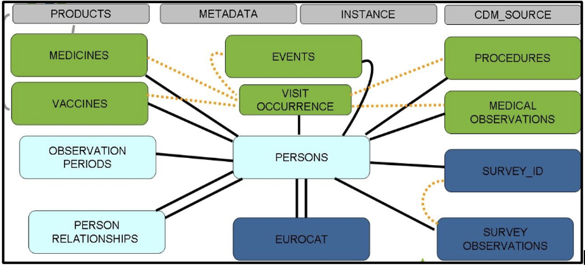

<!-- PROJECT LOGO -->
 

  
  

  
 <h3 align="center">Level 3 checks</h3>
 
 R scripts to produce high-level characterization data to benchmark across DAPs and with external resources. 

 
<!-- TABLE OF CONTENTS -->

  
Table of Contents

  <ol>
    <li>
      <a href="#about-the-project">About The Project</a>
    </li>
    <li>
      <a href="#level-3-checks">Level 3 checks</a>
    </li>
    <li>
      <a href="#getting-started">Getting Started</a>
      <ul>
        <li><a href="#prerequisites">Prerequisites</a></li>
        <li><a href="#installation">Installation</a></li>
        <li><a href="#Data characterization study links">Data characterization study links</a></li> 
        <li><a href="#current version">Current version</a></li>
      </ul>
    </li>
    <li><a href="#license">License</a></li>
    <li><a href="#contact">Contact</a></li>
  </ol>

<!-- ABOUT THE PROJECT -->
## About The Project

[ConcePTION](https://www.imi-conception.eu) aims to build an ecosystem that can use Real World Data (RWD) to generate Real World Evidence (RWE) that may be used for clinical and regulatory decision making. RWE is required to address the big information gap of medication safety in pregnancy.   

ConcePTION is designed to be a learning healthcare system (LHS). In the ConcePTION LHS, we have agreed upon a study-independent syntactically harmonized common data model and aim to assess the quality and fitness for purpose of data in this CDM in a study-independent way (for quality and completeness) and in study design and research question-specific ways (for fitness for purpose).

ConcePTION CDM tables:

  
  

<!-- Level 3 checks -->
## Level 3 checks

**Aims of Level 3 quality checks:**      
**1.**	To perform high-level data characterization of the [ConcePTION CDM]((https://docs.google.com/spreadsheets/d/1hc-TBOfEzRBthGP78ZWIa13C0RdhU7bK/edit#gid=413205035)) instance for each DAP and benchmark across DAPs and with external resources.     
***a.***	Assessing medication use in females of childbearing age and in pregnancy.    
***b.***	Assessing vaccine exposure in females of childbearing age and in pregnancy.   
***c.*** Calculation of incidence rates of events during pregnancy and before/after.             
***d.*** Assessing severity of specific maternal conditions.         
***e.*** Assessing prenatal and antenatal outcomes in relation to drug exposure for signal generation and signal evaluation.     
***f.*** Assessing medication use in the study population.     
***g.*** Assessing vaccine exposure in the study population.

***Level 3 checks will quantify population and person time in each data source for the source and study population as a whole as well as for subpopulations of interest. Examples of this type of check include: counts of codes extracted to identify each event and exposure of interest, counts of medication prescription and vaccine administrations etc.*** 

**The level 3 checks are divided in 8 major steps:**   

1.	Source and study population.   
2.	Medicines.   
3.	Vaccines.   
4.	Diagnoses.   
5.	Pregnancy.    
6.	Populations of interest.   
7.	Health-seeking behaviour and lifestyle factors.   
8.	EUROCAT indicators.   

<!-- GETTING STARTED -->
## Getting Started

Follow the steps below to run Level 3 checks in your data.   

### Prerequisites

R version 4.1.0 (2021-05-18)   

### Installation

1. Download the ZIP folder and extract the contents.   
2. Create a main folder with the name of your project(if you already have done so for Level 1/2 checks skip this step).     
3. Inside the main folder create the folder `Data characterisation`. Put the extracted folder inside.   
4. Inside the main folder create a folder named `CDMInstances`, which will be used to store the .csv files representing the CDM tables(if you already have done so for Level 1/2 checks skip this step).      
5. Inside the `CDMInstances` folder create a folder with the name of your project and inside the latter put all your .csv files(if you already have done so for Level 1/2 checks skip this step).      
6. In the folder `Level_3_checks_to_be_deployed_v1.0`, go to the script 99_path.R and change the variable Studyname(line 6) to the name of your project. Make sure that the name of the folder you have created in the folder `CDMInstances` and the name of the variable match exactly. Save it.         
7. Open the to_run.R script and you are ready to run level 3 checks.  

***Folder structure***

Main folder

 * [CDMInstances](./CDMInstances)
   * [Project_name](./CDMInstances/Project_name)
     * [files.csv](./CDMInstances/Project_name/files.csv)
     
 * [Data characterisation](./Data characterisation)
   * [Level_1_checks_to_be_deployed_v5.2](./Data characterisation/Level_1_checks_to_be_deployed_v5.2)
   * [Level_2_checks_to_be_deployed2.0](./Data characterisation/Level_2_checks_to_be_deployed2.0)
   * [Level_3_to_be_deployed1.0](./Data characterisation/Level_3_to_be_deployed1.0)
   
### Data characterization study links   

[Level 1 checks](https://github.com/vjolahoxhaj/Level-1-checks?organization=vjolahoxhaj&organization=vjolahoxhaj): Checking the integrity of the ETL procedure.     
[Level 2 checks](https://github.com/IMI-ConcePTION/Level-2-checks): Checking the logical relationship of the CDM tables.    
[Level 3 checks](https://github.com/IMI-ConcePTION/Level-3-checks): Benchamrking across DAPs and external sources.     

### Current version

The current version of the script is 1.0.

<!-- LICENSE -->
## License

Distributed under the BSD 2-Clause License License. See `LICENSE` for more information.

<!-- CONTACT -->
## Contact

Vjola Hoxhaj - v.hoxhaj@umcutrecht.nl     
Roel Elbers - R.J.H.Elbers@umcutrecht.nl       

Project Link: [https://github.com/IMI-ConcePTION/Level-3-checks](https://github.com/IMI-ConcePTION/Level-3-checks)

